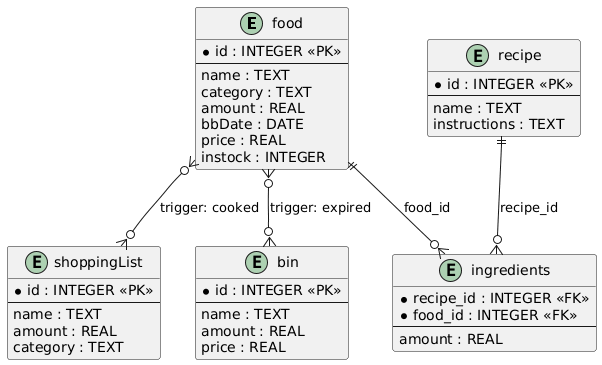

# Design Document

## Video overview:
[Watch the project overview video](https://youtu.be/rdAv_ZFppDM)

## Scope

### Purpose
The purpose of FreshMatch is to reduce grocery waste by tracking expiration dates, analyzing discarded items, and helping users cook with ingredients nearing their best-before date. The database also maintains an organized shopping list automatically.

### In-Scope
- **People:**
people who manage grocery shopping and cooking in their households and who want to track food inventory, reduce waste, and maintain an organized shopping list.
- **Places:**
Homes where food is stored and meals are prepared.
- **Things:**
Food items, expiration date management, recipes, shopping lists and waste management.

### Out-Of-Scope
- Tracking items without expiration dates.
- Sharing expiration alerts with others.
- Nutrition analysis or calorie counting.

## Functional Requirements

### User Capabilities
- View foods nearing or past their best-before dates.
- Access recipes using soon-to-expire ingredients.
- Add or delete items from food storage or the shopping list.
- Automatically track money spent on discarded food.
- Deleted items automatically move via triggers to the shopping list or bin depending on expiration.

### Beyond Scope
- Sharing groceries with other users.

## Representation

### Entities

The core entities are `food`, `recipe`, `ingredients` (junction table), `shoppingList`, and `bin`.
The tables `shoppingList` and `bin` are filled automatically by the triggers `cooked` and `expired`.

### Attributes

#### **food**
- `id`: INTEGER PRIMARY KEY — unique identifier
- `name`: TEXT — food name
- `category`: TEXT — e.g., dairy, dry, veggie, fruit, meat, fish
- `amount`: REAL — quantity (supports fractional values)
- `bbDate`: DATE — best-before date
- `price`: REAL — cost
- `instock`: INTEGER — availability flag (1 = in stock, 0 = not in stock)

#### **recipe**
- `id`: INTEGER PRIMARY KEY
- `name`: TEXT
- `instructions`: TEXT

#### **ingredients** (junction table)
- `recipe_id`: INTEGER — FK to `recipe(id)`
- `food_id`: INTEGER — FK to `food(id)`
- `amount`: REAL — required quantity

#### **shoppingList** (populated by `cooked` trigger)
- `id`: INTEGER PRIMARY KEY
- `name`: TEXT — item to buy
- `amount`: REAL — needed quantity
- `category`: TEXT

#### **bin** (populated by `expired` trigger)
- `id`: INTEGER PRIMARY KEY
- `name`: TEXT — discarded item
- `amount`: REAL — discarded quantity
- `price`: REAL — cost of discarded food

## Relationships

- `ingredients` is a junction table connecting `recipe` and `food` (many-to-many).
- `bin` and `shoppingList` are populated automatically via triggers (`expired` and `cooked`) when items are deleted from `food`. Post-expiration deletions go to `bin`; fresh items go to `shoppingList`.

## Optimizations

### Views
- **comingUp**: Foods expiring within 5 days.
- **pastDue**: Foods past their best-before dates.
- **showRecipe_ApproachBB**: Recipes using soon-to-expire ingredients.
- **groceryList**: Sorted shopping list by category and name.

### Indexes
- `recipe_id` and `food_id` in `ingredients` to speed up queries.

### Triggers
- **expired**: Moves expired items to `bin` automatically.
- **cooked**: Adds non-expired deleted items to `shoppingList` automatically.

## Limitations
- Automatic moving to the shopping list may create duplicates; the user should review the list before purchasing.
- Freshness of fruits and vegetables is not guaranteed, as they may lack precise expiration dates and often require visual/olfactory checks.
- Scope limitation: This is a simplified household database. It does not support multiple users, multiple storage locations, permissions, or advanced features such as nutrition tracking or calorie calculations. Implementing multi-user support, location awareness, or nutrition analysis would require schema and application changes beyond the current scope.
